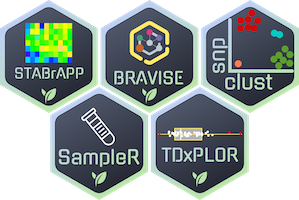

# ShinyBrAPPs 

The ShinyBrAPPs package contains shiny applications designed for plant breeders. An international collaboration of developers from CIRAD and the IBP have been working together as part of the [IAVAO](https://www.iavao.org/) breeders community to develop these ShinyBrAPPs, in support of national breeding programs in Western Africa. 

These applications can be connected to datasources that implement BrAPI compliant web services. BrAPI, for Breeding API is a standardized application programming interface (API) specification for breeding and related agricultural data. BrAPI compliance offers these systems the opportunity to add functionalities in a modular way through the development of external plugin applications that can quickly fulfill specific needs for this group of breeders and scientists.

Currently, ShinyBraPPs applications are connected to the Breeding Management System ([BMS](https://bmspro.io/)) and/or [Gigwa](https://www.southgreen.fr/content/gigwa). They are accessible directly from those systems interface.


## Installation

Install remotes package if not already done

``` r
install.packages(remotes)
```

Install required brapir package that is not available on cran
``` r
remotes::install_gitlab('alice.boizet/brapir', host = 'https://gitlab.cirad.fr')
```

Install shinybrapps package

``` r
remotes::install_github("IntegratedBreedingPlatform/ShinyBrAPPs")
```
or for latest development version: 
``` r
remotes::install_github("IntegratedBreedingPlatform/ShinyBrAPPs@dev")
```

### Build docker image
```
docker build -f deploy/Dockerfile_base --progress=plain -t shinybrapps_base .
docker build -f deploy/Dockerfile --progress=plain -t shinybrapps .
```

## Applications

### TDxPLOR
TDxPLOR, the trial data explorer, retrieves data from multi-location trials and displays data counts and summary box-plots for all variables measured in different studies. It also provides an interactive distribution plot to easily select observations that require curation and a report of candidate issues that needs to be addressed by the breeder.  
``` r
shinybrapps::run_trialdataxplor()
```

### STABrAPP
STABrAPP is an application for single trial mixed model analysis. It basically provides a GUI to the StatgenSTA R package.
``` r
shinybrapps::run_stabrapp()
```

### BrAVISE
The BrAVISE application is a decision support tool helping breeders to run GxE analysis, select germplasm according to their various characteristics and save lists of selected germplasm to the BMS
``` r
shinybrapps::run_decision()
```

### SampleR
The SampleR application allows to search samples from different entry points (study, germplasm, DbId) and to print labels.
``` r
shinybrapps::run_samplr()
```

### snpclust
snpclust enables a user to check and manually correct the clustering of fluorescence based SNP genotyping data. snpclust is not included to this package yet. It is accessible here : https://github.com/jframi/snpclust

## Deployment and Integration with BrAPI compliant system

ShinyBrAPPs can be deployed using docker.

Once deployed, the BrAPPs can be launched using the following URL parameters

|   Parameter    |                                   Description                                   |      Used in      |                       Example                       |
|----------------|---------------------------------------------------------------------------------|-------------------|-----------------------------------------------------|
| apiURL         | base URL for the BrAPI server that the BrAPP needs to connect to                | All               | ?apiURL=https://test-server.brapi.org/brapi/v2/     |
| cropDb         | crop database name                                                              | All               | ?cropDb=Maize                                       |
| token          | a valid token                                                                   | All               | ?token=user:avalidtoken                             |
| studyDbIds     | a comma separated list of studyDbIds that the BrAPP needs to retrieve data from | STABrAPP, BrAVISE | ?studyDbIds=121,122,123                             |
| obs_unit_level | a comma separated list of observation unit levels to filter on                  | STABrAPP, BrAVISE | ?obs_unit_level=PLOT,MEANS                          |


## Funding

ShinyBrAPPs development was funded by the [ABEE project](https://capacity4dev.europa.eu/projects/desira/info/abee_en) under the DESIRA initiative of the European Union.


