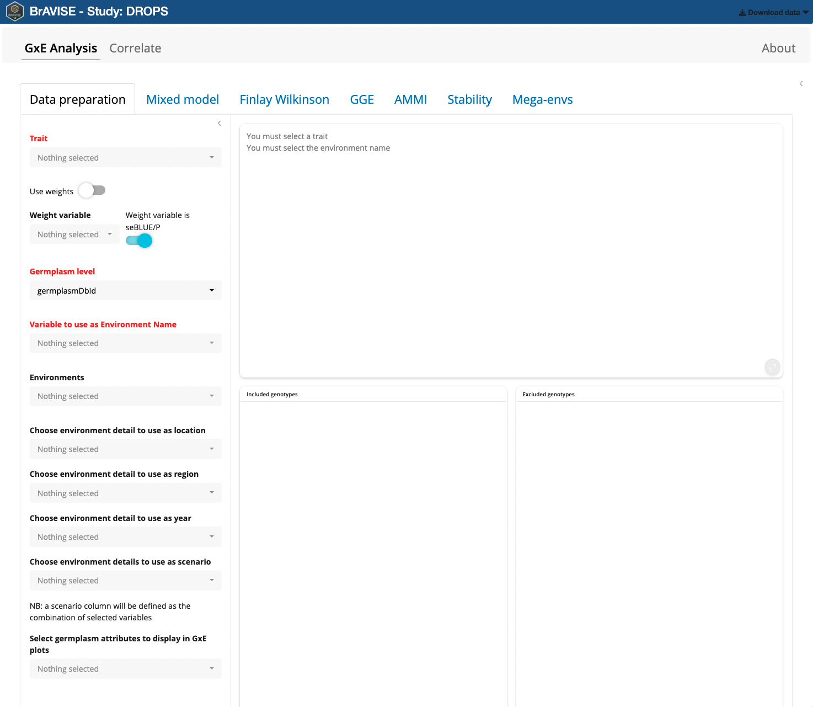
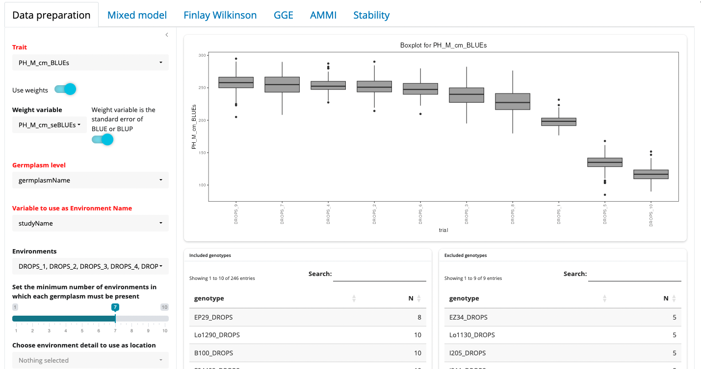
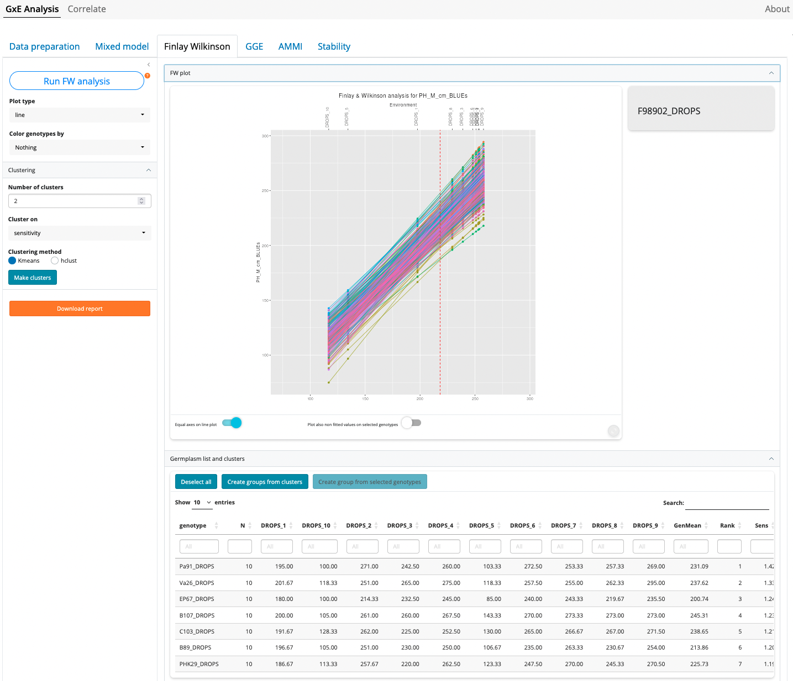
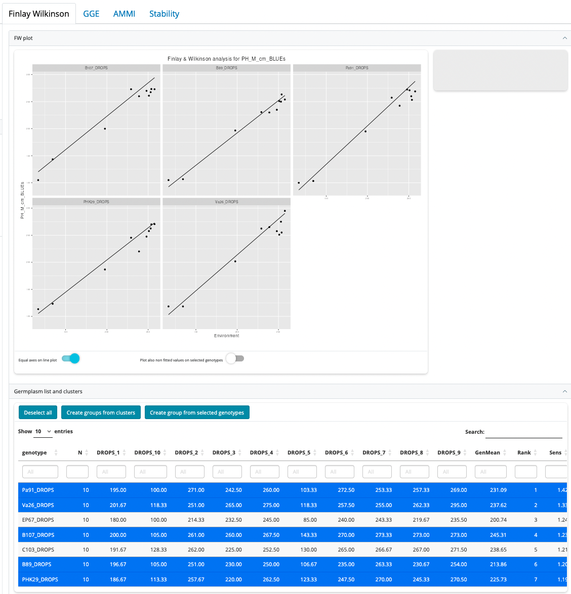
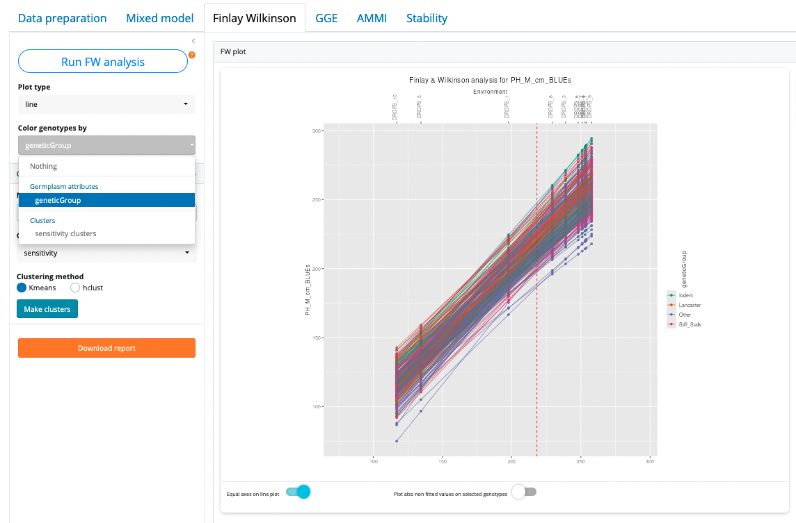

```{r, echo=FALSE}
htmltools::img(src = knitr::image_uri("figures/bravise/sticker.png"), 
               alt = 'logo', height="200px",
               style = 'position:absolute; top:0; right:0; padding:10px;')
```

Decoding Data, Driving Decisions.

BrAVISE is a Decision Support application that helps breeders to get the most of experimental data, especially in a multi-environments perspective, and turn it into breeding decisions.


## [Loading Data](load_data.html)

## Application components

BrAVISE contains two main tabs corresponding to two different ways of analyzing the same dataset:

- GxE analysis: allows to run a large range of GxE analysis on observation data at the MEANS observation unit level. In other words, it performs the second stage of a two-stage analysis of multi-environment trials, once the first step was complete using STABrAPP. It is built on top of the [statgenGxE](https://biometris.github.io/statgenGxE/index.html) package.
- Correlate: allows to build complex scatter plots comparing variables at different observation levels, but also environment details, germplasm attributes and more.

These two components of the BrAVISE app share a common third component to manage groups of germplasms that can be defined in various part of the application from analysis results or manual selection of genotypes. Groups of germplasms can be merged, intersect, saved or exported as germplasm list to a BMS instance.

## GxE Analysis

### Data Preparation

When the application has finished loading data, and before starting any analysis, the user needs to prepare data by providing different information. Mandatory information are the fields in red : Trait, Germplasm Level, and Variable to use as Environment Name.



First you need to pick a trait as GxE analysis are conducted trait by trait. Indeed, as BrAVISE is an interactive application there is no way to launch here the same analysis on different traits in batch mode. In the Trait picker input, only MEANS variables are listed. By default those are variables that ends by `BLUEs` or `BLUPs` suffix (this can be changed by an app configuration parameter).

When the selected variable ends by BLUEs or BLUPs, the `Use weights` switch is automatically activated and the corresponding seBLUEs or seBLUPs variable is selected and a weight variable is defined as 1/seBLUEs^2 or 1/seBLUPS^2. 

Then Germplasm level needs to be selected. It can be either GermplasmDbId or GermplasmName. Choosing one or the other may have an impact on the way genotypes will be aggregated in different environments. Indeed, you may have the same genotype that has been evaluated in different environments over locations or years with different germplasmDbIds (e.g. corresponding to different cycles of multiplication). In this case you may prefer to use GermplasmName as you want to consider different germplasms as corresponding to the same genotype in a GxE analysis perspective.

Lastly, you need to indicate which variable will be used to identify Environments. The variables listed here are the environment details that unambiguously distinguish between the different StudyDbIds. In case a more meaningfull variable containing environment names has been defined as environment detail in your BrAPI source, it is preferable to use it over studyDbId that is in general just a simple number.

When the 3 mandatory variables have been defined, boxplots of the trait distribution in the different environments are displayed.



From here, different options can be adjusted to fine tune the dataset before proceeding with analysis.

- Environments can be included or excluded from the Environments picker list
- A minimum number of environments in which each germplasm must be present can be set. If the dataset is not fully balanced, increasing this value will trigger the exclusion of some genotypes that are not present in all environments. The lists of included and excluded geneotypes will be updated accordingly.
- Optionally select environment details to be used as location, region, year, or environmental scenario. These may be used in some of the analyses especially the mixed model section.
- Some germplasm attributes can also be selected here as variables used to color genotypes in different GxE plots.

### Mixed model

Refer to [statgenGxE](https://biometris.github.io/statgenGxE/articles/statgenGxE.html#vcomp){target="_blank"} manual for detailed statistical background.


### Finlay Wilkinson

Refer to [statgenGxE](https://biometris.github.io/statgenGxE/articles/statgenGxE.html#fw){target="_blank"} manual for detailed statistical background.



Click first on "Run FW Analysis"

#### Plot type
Though the most common type of plots for Finlay-Wilkinson analysis is the "line" type (the default), three other types of plots are possible:

- scatter: creates three scatter plots where genotypic mean, square root of the mean squared deviation and sensitivity are plotted against each other.
- trellis: creates a trellis plot with observations and slopes per genotype. The set of genotypes to display must be selected in the germplasm list table, under the plot.
- scatterFit: creates a scatter plot of fitted values in the trial with the highest environmental effect against the fitted values in the trial with the lowest environmental effect.



#### Color genotypes by

In all plots it is possible to color the genotypes by a variable that has been selected in the Data Preparation tab. If groups of germplasms have been created it is also possible to color germplasm based on these groups.



#### Clustering of genotypes

It is possible to cluster genotypes based on sensitivity or mean values (or both). To cluster genotypes, first select the number of clusters (from 2 to 8), select whether clustering must be done on sensitivity or geneotype means, or both together. Then select a clustering method (kmeans or hclust) and click "Make clusters".

#### Plot interaction

The line plot has the following interaction features:

- Hover mouse next to a line: this will display the genotype name is the right upper corner grey zone
- Click on a line or a point: this will select (highlight) the corresponding genotype in the plot and in the germplasm list table
- Double-click anywhere in the plot: will deselect everything
- Selecting/deselecting a row in the germplasm list table: this is equivalent to clicking a line in the plot

Plot options:

- Equal axes on line plot: by default the line plot has equivalent scales on x and y axes. In some cases it is useful to deacivate this option to make a wider plot and better distinguish environments with close means.
- Plot also non fitted values on selected genotypes: when one or more genotypes are highlighted it is possible to also display the points of observed values in additionn to fitted value (like in the trellis plot). This allow to vizualise the quality of FW model for a given genotypes but is quickly difficult to read when the number of selected genotypes is important.

#### Create groups
#### Report


### GGE

Reference manual on [statgenGxE](https://biometris.github.io/statgenGxE/articles/statgenGxE.html#gge){target="_blank"}

### AMMI

Reference manual on [statgenGxE](https://biometris.github.io/statgenGxE/articles/statgenGxE.html#am){target="_blank"}

### Stability

## Correlate
## Groups
