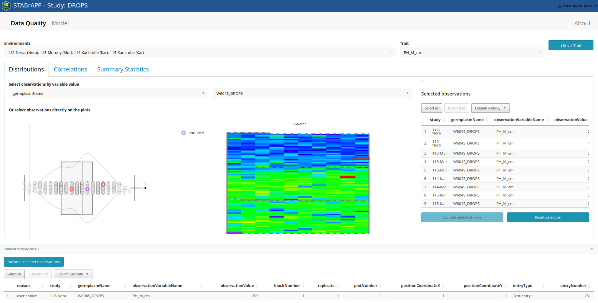
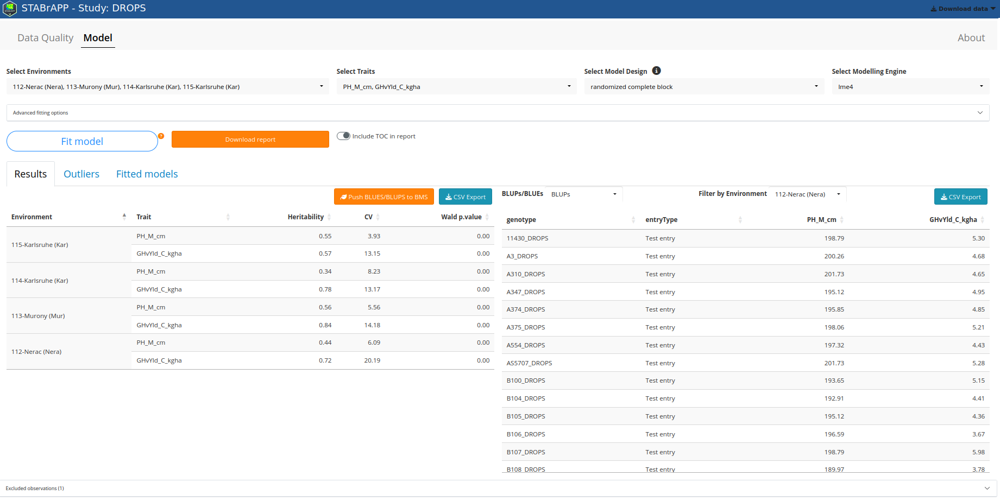
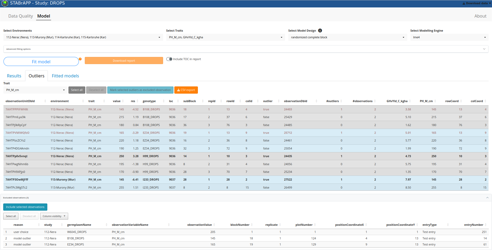
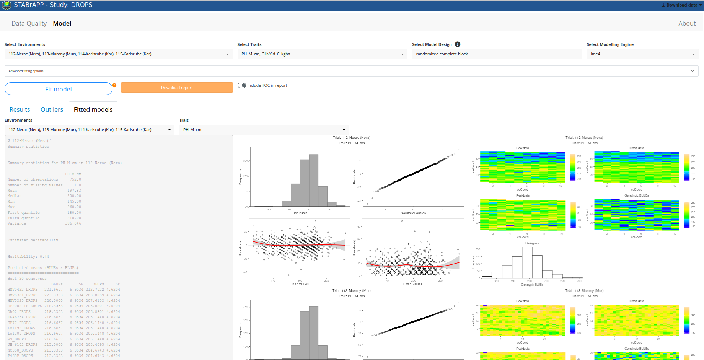

# STABrAPP

STABrAPP is an application for single trial mixed model analysis. It provides a GUI to the StatGen-STA R package (https://biometris.github.io/statgenSTA/) for data that are loaded from BrAPI compliant systems such as BMS (Breeding Management System)

# [Loading Data](load_data.html)

# Application structure
STABrAPP contains 2 tabs (Data quality and Model) and an accordion below those tabs called "excluded observations". These accordion lists the observations that could have been excluded from manual selection in Data quality tab or from outliers detection in Model tab.

# Data Quality
This tab contains 2 dropdown lists (environments and trait). You can select multiple environments but only one trait. Below there are tabs that shows data and/or plots for the selected environments and trait.

## Distributions
The tab shows the distribution plots and spatial plots for selected environments and selected trait.

### Points selection
You can select observations by selecting a variable value (choose the variable and its value) or you can manually select data points in the plot. A sidebar will appear on the right with the selected observations. You can select the lines and exclude the selected observations. The excluded observations appear in purple on the plots and are listed in the accordion below.

## Correlation
This tab shows a plot of the correlations between the selected environments for the selected trait

## Summary statistics
This tab contains a table of summary statistics for the selected trait in each selected environments.

# Model
The **model** tab enables to run single trial analysis for all selected environments and traits.  
Before clicking on "fit model", you have to select the environments, the traits, the experimental design and the model engine.
The model will be fitting on all selected environments and traits for which there are observations (without the excluded observations)

## Results
The **Results** tab shows on the left the metrics and on the rights the calculated Means (BLUES, BLUPS, seBLUEs, seBLUPs)
You can export all the metrics by clicking on "Export CSV".  
You can send to BMS the means by clicking on "Push BLUEs/BLUPs to BMS". This will push all of them to BMS. You can select lines in the table on the left to choose for which environment and trait you want to push the BLUEs/BLUPs.

  

## Outliers
The **Outliers** tab shows the detected outliers. For each outlier (in bold), you can see the values measured on the same plot for the other traits.  

You can select the outliers you want to exclude. They will appear in the "excluded observations" accordion.

## Fitted models
The **Fitted models** tab shows the models summary and a series of four plots: a histogram of the residuals, a normal quantile plot of the residuals, a scatter plot of residuals against fitted values and a scatter plot of absolute residuals against fitted values.  
For spatial models, it also shows spatial plots.

## Download Report
Clicking on the button **Download Report** will generate a report in word format. This report contains for each selected trait and environment all the plots, statistics, and predicted means that were calculated in the fitted model. If you change the selection of the environments and/or traits, you have to fit the model first to be able to download the report.
