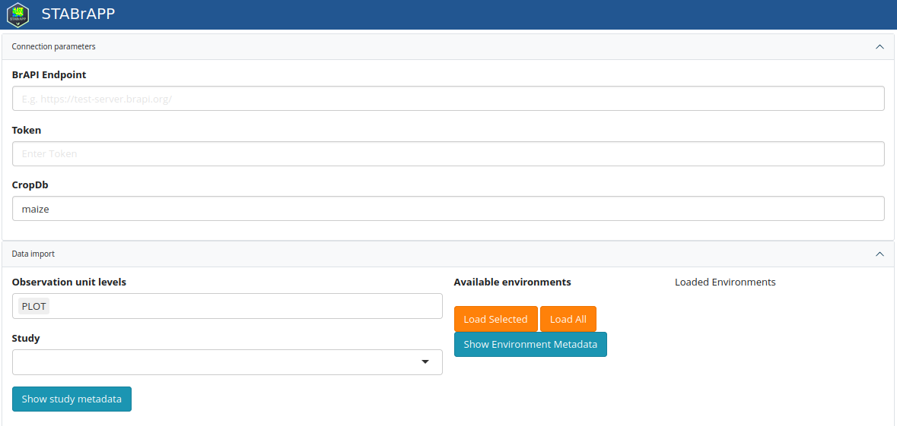

All ShinyBrAPPs use the same module to load data.

## Use the application with any endpoint
### Connection parameters
In this section, the user is expected to provide the parameters to establish the connection with a BrAPI endpoint (server)

- BrAPI endpoint: the web services URL (e.g. https://test-server.brapi.org/)
- Token: a valid token to be used for authentication
- cropDB: the crop name (for multicrop systems)

### Data Import
In the Data import section, the user will provide details to query the BrAPI endpoint and extract the dataset he's interested in.

- Observation unit levels: either PLOT or MEANS, or both. NB that depending on the application, the observation unit level may be filtered (e.g. STABrAPP only uses PLOT observation level)
- Study: select a study among the list of available studies (NB: `study` follows here BMS terminology. It corresponds to `trial` in the BrAPI terminology)
- Available environments: once one or more study is selected the list of environments (studies in the BrAPI terminology) appears, and the user is expected to select one or several of them and click on `Load Selected` to retrieve the corresponding dataset. Alternatively the user can click on `Load All` to load the data corresponding to all environments of the selected study.

## Integration with a BrAPI compliant system

ShinyBrAPPs can be launched from a BrAPI compliant system, providing connection and data import parameters using the following URL parameters.
In this case the connection and data import UI components are not displayed.

|   Parameter    |                                   Description                                   |      Used in      |                       Example                       |
|----------------|---------------------------------------------------------------------------------|-------------------|-----------------------------------------------------|
| apiURL         | base URL for the BrAPI server that the BrAPP needs to connect to                | All               | ?apiURL=https://test-server.brapi.org/     |
| cropDb         | crop database name                                                              | All               | ?cropDb=Maize                                       |
| token          | a valid token                                                                   | All               | ?token=user:avalidtoken                             |
| studyDbIds     | a comma separated list of studyDbIds that the BrAPP needs to retrieve data from | STABrAPP, BrAVISE | ?studyDbIds=121,122,123                             |
| obs_unit_level | a comma separated list of observation unit levels to filter on                  | STABrAPP, BrAVISE | ?obs_unit_level=PLOT,MEANS                          |

